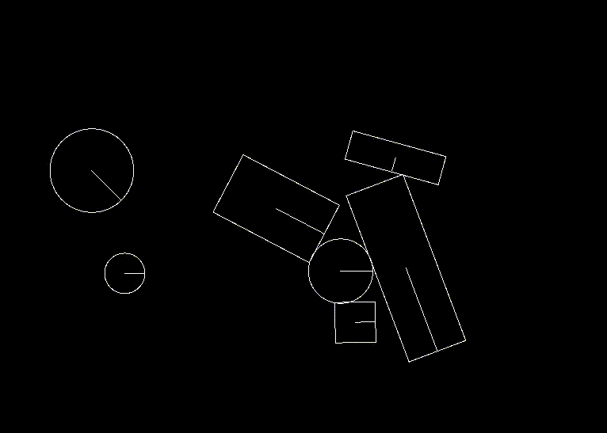

# Gust - A Basic 2D Physics Engine in Modern C++14



Gust is a simple 2D physics engine written in modern C++14, inspired by [Cyclone](https://github.com/idmillington/cyclone-physics). Gust has limited collision resolution capability (don't expect it to be stable with stacks of objects) but expresses the fundamental concepts of rigid body dynamics well and can be a good source to read for people who want to get started with physics engine implementations.

## Features
- Collision detection for circles, rectangles, and convex polygons.
- Impulse based sequential collision resolution, using visitors was a nice touch in collision detection on top of cyclone for ease of use.
- A basic XML parser to use with [Tiled](https://www.mapeditor.org/) and some examples.

## Installation Requirements
I haven't tried to build Gust on any non-Linux platform yet but it should work with whatever you need to install to make SFML compile. vcpkg should be able to install the others for you, just clone it under the project directory and follow its [instructions](https://vcpkg.io/en/getting-started).

For OpenGL and other libraries vcpkg will have trouble with, you need to install the following packages in Ubuntu 22.04:
```
sudo apt install autoconf libtool libx11-dev libxrandr-dev libxcursor-dev libxi-dev libudev-dev libgl1-mesa-dev build-essential git make pkg-config cmake ninja-build gnome-desktop-testing libasound2-dev libpulse-dev libaudio-dev libjack-dev libsndio-dev libx11-dev libxext-dev libxrandr-dev libxcursor-dev libxfixes-dev libxi-dev libxss-dev libxkbcommon-dev libdrm-dev libgbm-dev libgl1-mesa-dev libgles2-mesa-dev libegl1-mesa-dev libdbus-1-dev libibus-1.0-dev libudev-dev fcitx-libs-dev libpipewire-0.3-dev libwayland-dev libdecor-0-dev
```